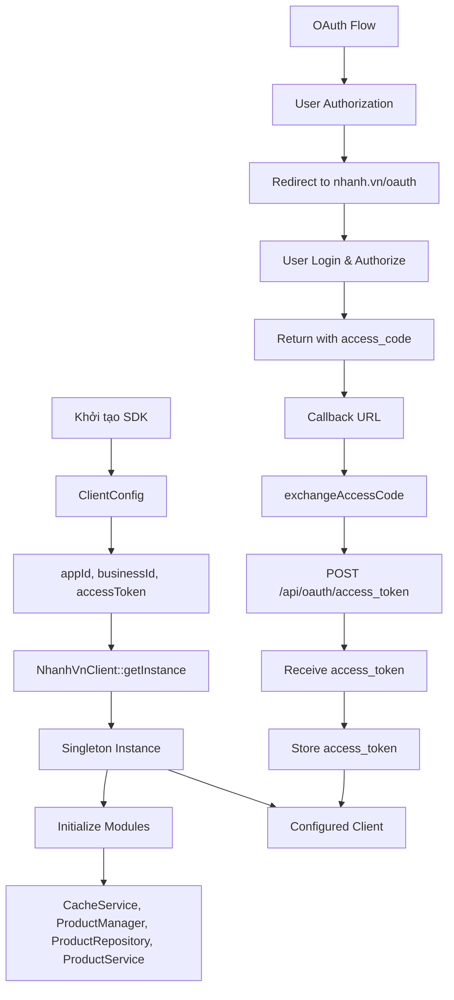
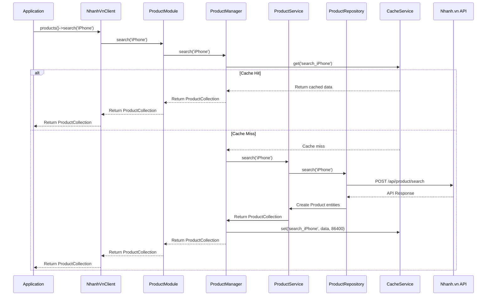
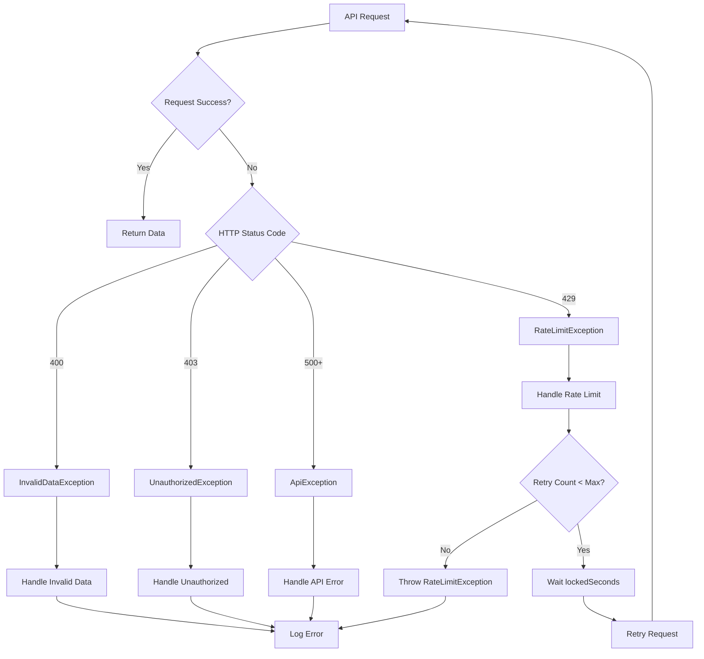
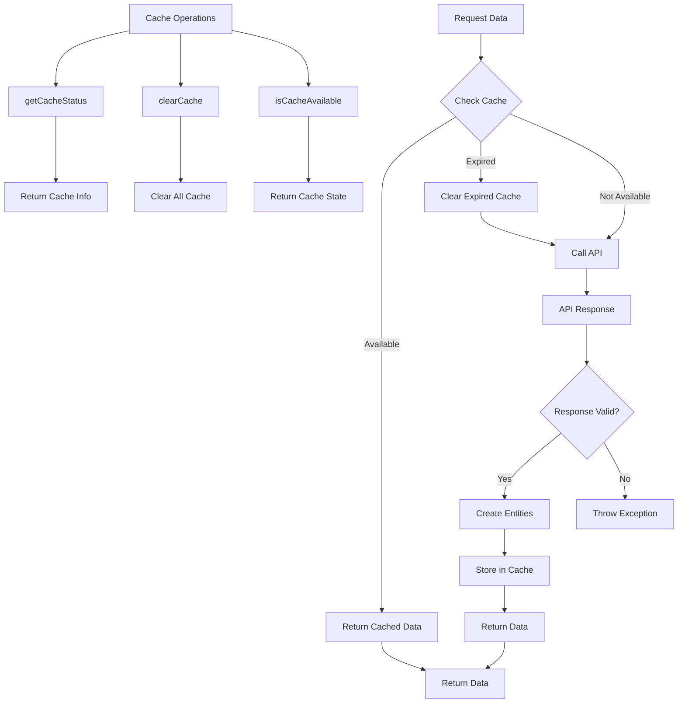
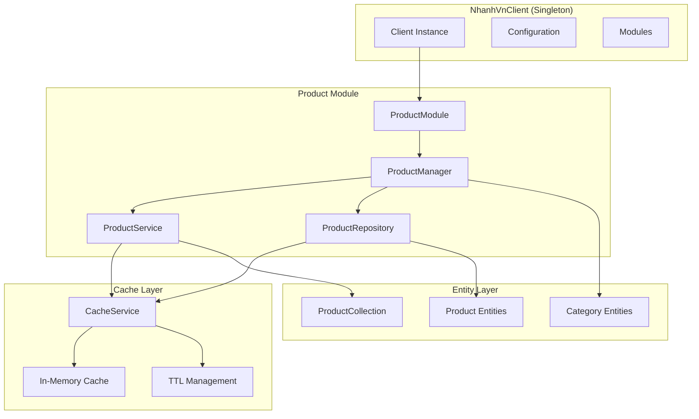
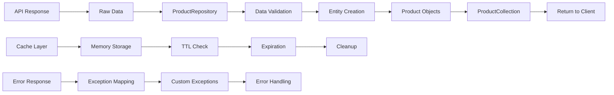

# Nhanh.vn SDK v2.0 - Flow Diagram

## Khởi tạo và OAuth Flow

## API Request Flow

## Error Handling Flow

## Cache Management Flow

## Module Architecture

## API Endpoints

- **Product Search**: `/api/product/search`
- **Product Detail**: `/api/product/detail`
- **Product Add**: `/api/product/add`
- **Product External Images**: `/api/product/externalimage`
- **Product Categories**: `/api/product/category`
- **Product Brands**: `/api/product/brand`
- **Product Types**: `/api/product/type`
- **Product Suppliers**: `/api/product/supplier`
- **Product Depots**: `/api/product/depot`

## Data Flow

